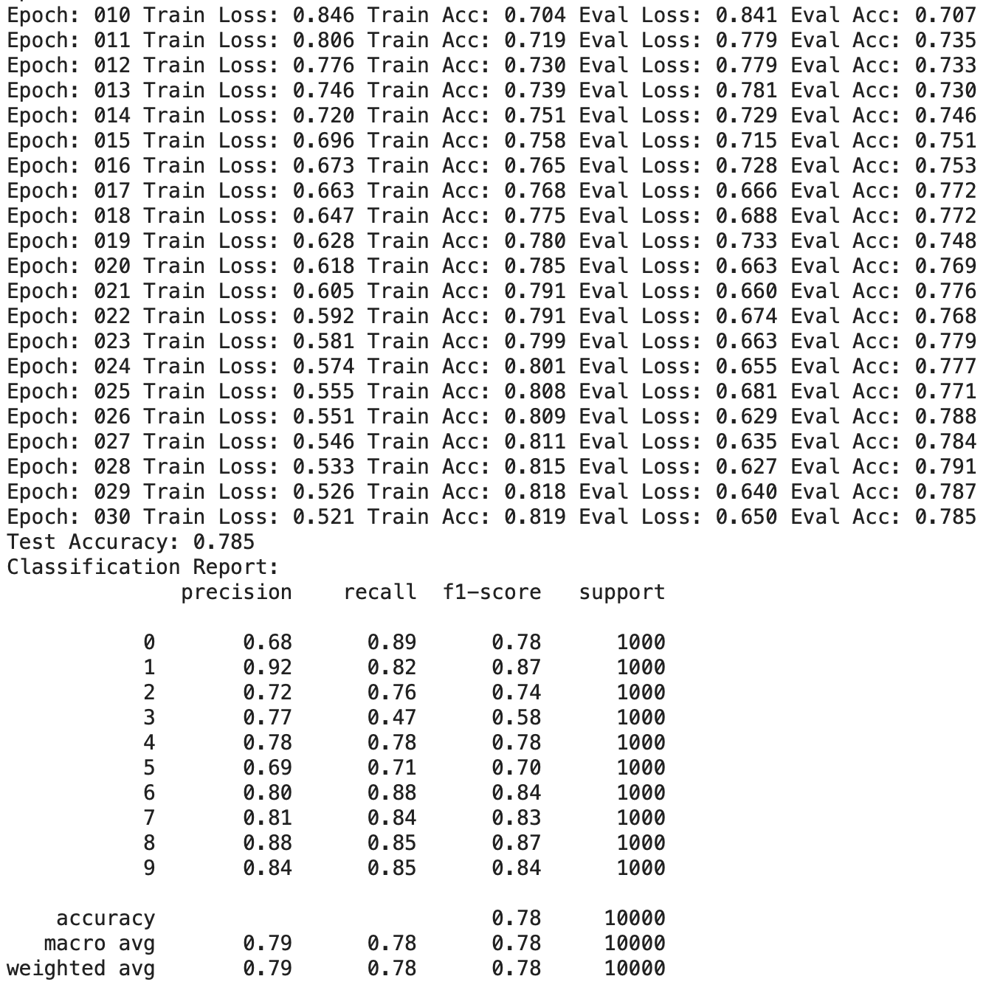
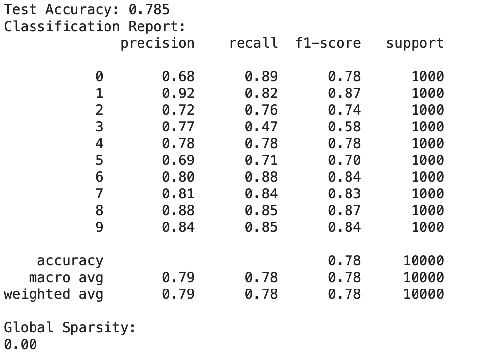
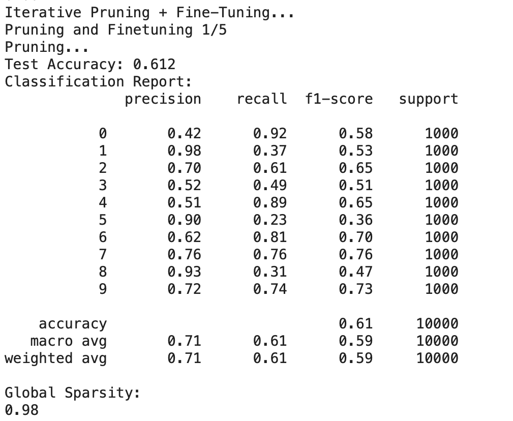
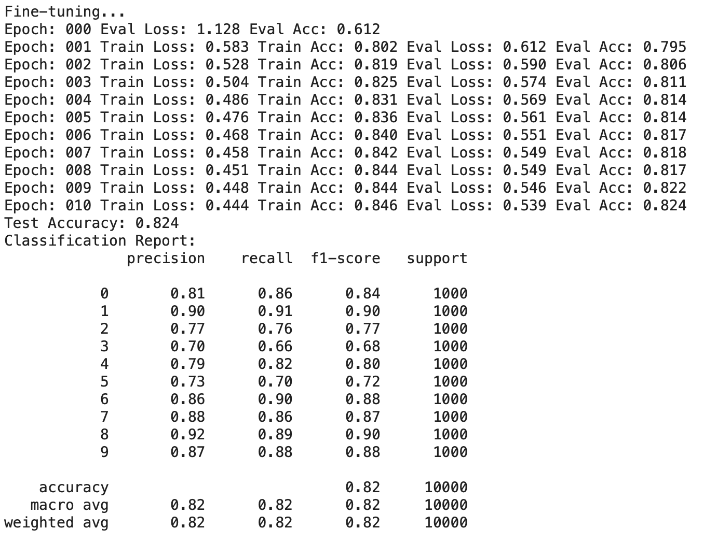

# PyTorch Pruning

## Introduction

PyTorch pruning example for ResNet. ResNet18 pre-trained on CIFAR-10 dataset maintains the same prediction accuracy with 50x compression after pruning.

## Usages

### Build Docker Image

```
$ docker build -f docker/pytorch.Dockerfile --no-cache --tag=pytorch:1.8.1 .
```

### Run Docker Container

```
$ docker run -it --rm --gpus device=0 -v $(pwd):/mnt pytorch:1.8.1
```

### Run Pre-Training

```
$ python pretrain.py
```

### Run Pruning

```
$ python prune.py
```

## Result of test
### Run Pre-Training



### Run Pruning




## References

* [PyTorch Pruning](https://leimao.github.io/blog/PyTorch-Pruning/)
* [PyTorch Pruning Tutorial](https://pytorch.org/tutorials/intermediate/pruning_tutorial.html)
